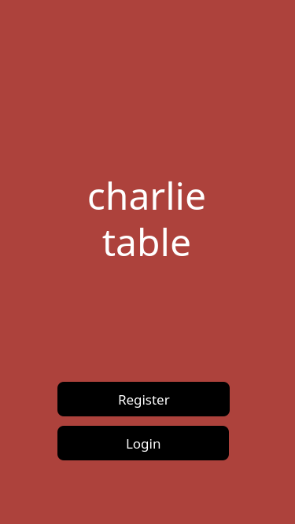
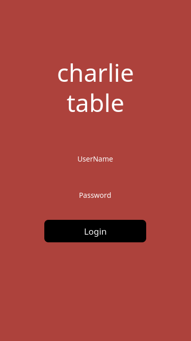
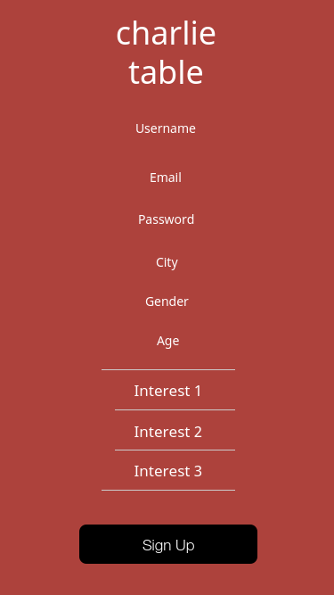

# Charlie Table

Software Engineering Fall 2017 Project by Dana, Peter, Megan, Jihyun

## About
[Charlie Table](https://charlietable.bitballoon.com) is an interest-based social dining app that connects 4 (or more) strangers together for a meal. It will be a native app built with [React Native](https://facebook.github.io/react-native/).

You can read more about the project purpose in the [wiki](https://github.com/jihjihk/charlietable/wiki/).

## Project Progress

We are using [Github Projects](https://github.com/jihjihk/charlietable/projects/1) to track our to-do/doing/done tasks. For each task, we are creating an issue, which is automatically pulled into the Project board.

## Mockups

